<!-- ============================================================================================= TANITIM & ÜRÜN KİMLİĞİ ============================================================================================================= -->

# 👾 Google OUA 3.0 Bootcamp - Unity#120

  
<h2>Ürün Kimliği</h2>

## → Takım Üyeleri

| İsim          | Rol            | LinkedIn                           | GitHub                           |
|---------------|----------------|------------------------------------|----------------------------------|
| Yaman Özdoğan   | Product Owner & Developer          | 

 | 

 |
| Yarkın Gökçel   | Scrum Master & Developer          | 

 | 

 |
| Yakup Taşpınar   | Developer          | 

 | 

 |
| Zeynep İrem Tekin   | Developer          | 

 | 

 |
<!-- | Zeynep Erden   | ❌ Takıma Dahil Olmadı ❌ | 

 | 

 | --> 

## → Oyun İsmi
### **`Nightfall Defender`**

  

## → Oyun Açıklaması

Nightfall Defender, 3D grafiklere sahip bir aksiyon oyunudur. Oyuncular, kasabanın geceleyin zombilere dönüşen karanlık tehlikesine karşı cesurca mücadele eden bir şerif olarak rol alırlar. Bu heyecan verici oyun deneyiminde, kasabanın sokaklarında dolaşan zombilere karşı koymak ve sakinleri korumak için silahlarını kullanırlar.

## → Oyun Özellikleri

- 3D TPS
- Shooter
- Nişancı
- Rekabetçi
- Strateji

## → Hedef Kitle

- Rekabetçi oyuncular
- 7+
- Aksiyon türü sevenler
- 3D TPS sevenler

## → Product Backlog'a ulaşmak için <a href="https://miro.com/app/board/uXjVK2W5oos=/?share_link_id=615510999047" target="_blank">tıkla</a>

<!-- ============================================================================================= TANITIM & ÜRÜN KİMLİĞİ ============================================================================================================= -->

<!-- ============================================================================================= SPRINT1 ============================================================================================================= -->

<h2>SPRINT-1</h2>

- İlk sprint içi puan kriteri 10 olarak belirlenmiş ve hedefe ulaşılmıştır.
- **Puan Tamamlama Mantığı** : Proje boyunca tamamlanması gereken backlog puanı 40 olarak belirlenmiştir.
- **Daily Scrum** toplantıları Discord üzerinden yapılmıştır. Gerek görüldüğü vakitlerde WhatsApp üzerinden desteklenmiştir.
- **Sprint Notları** : İlk sprintte takım üyeleri birbiri ile tanıştı ve takım içerisinde herkesin yetenekleri ve ilgi alanlarına göre görev dağılımı yapıldı. Oyuna karar verildikten sonra ilk iş olarak harita tasarımı yapıldı ve ardından daily scrumlarda seçilen karakter oyuna hareket sistemi ile birlikte eklenerek oyunun temeli hazırlandı. Sprint başında koyulan görevler,hedefler eksiksiz şekilde tamamlandı. İlk sprint tanışma ve adaptasyon odaklı geçtiğinden ötürü bir sonraki sprinte tam performans girilmesi gerektiği vurgulandı.

<h3>Daily Scrum Screenshots</h3>

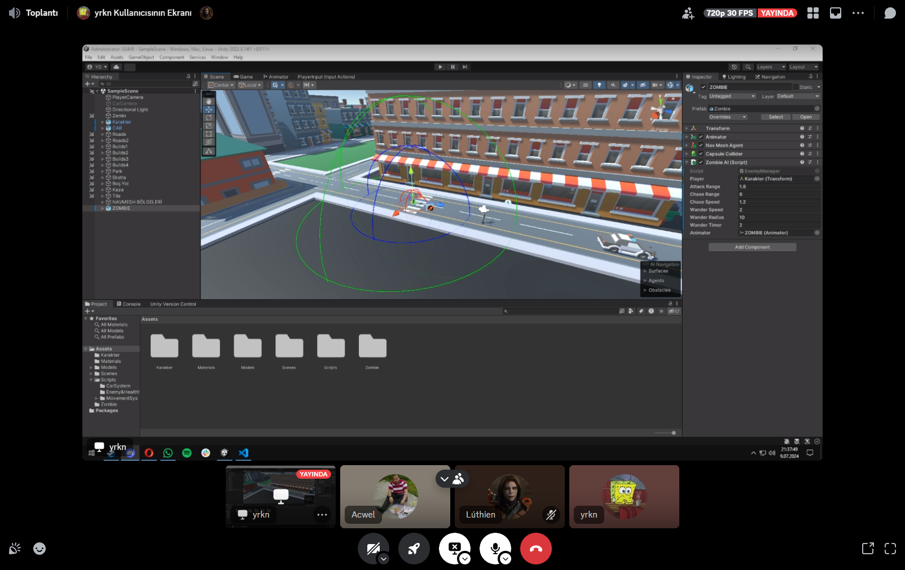   
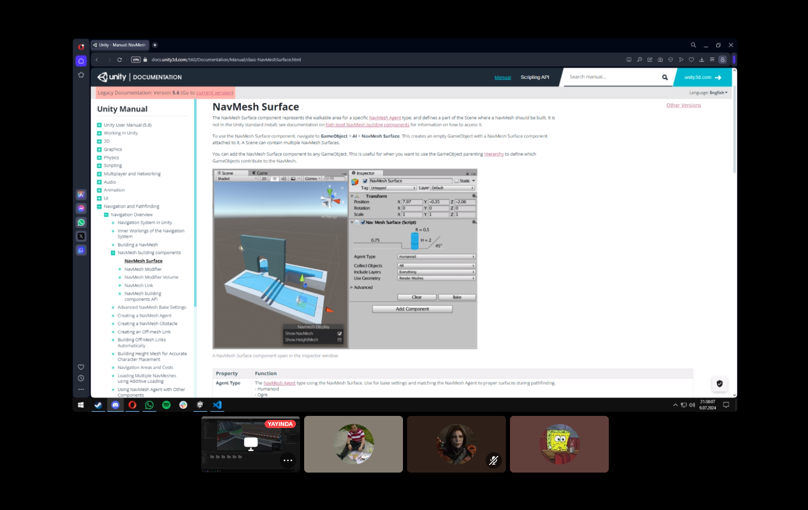   
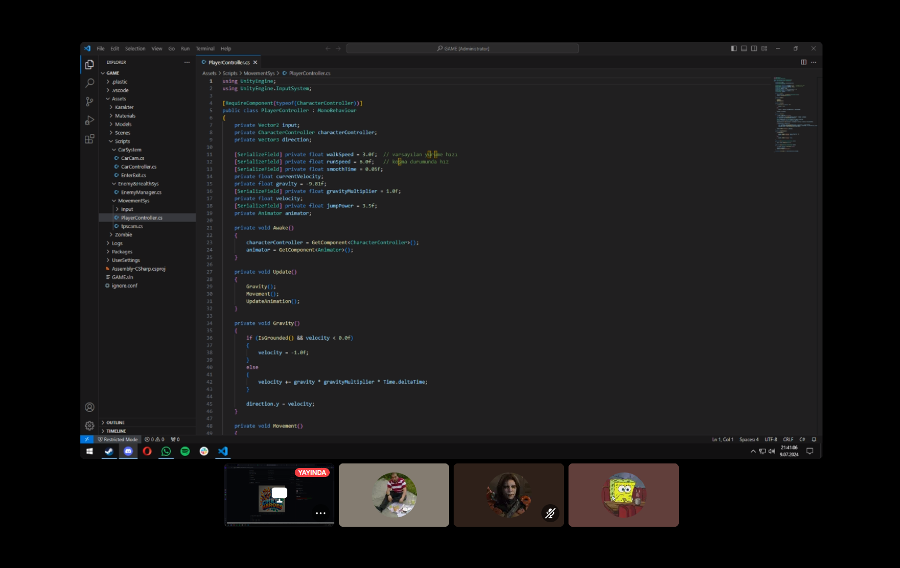    

  
  

<h3>Sprint - 1 Board Update</h3>

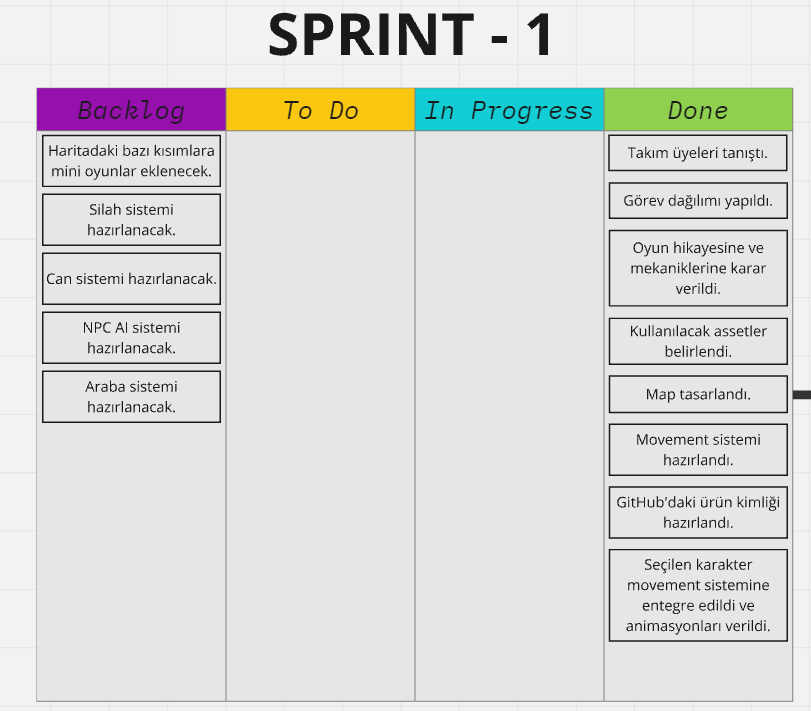    

<h3>Oyun Durumu</h3>

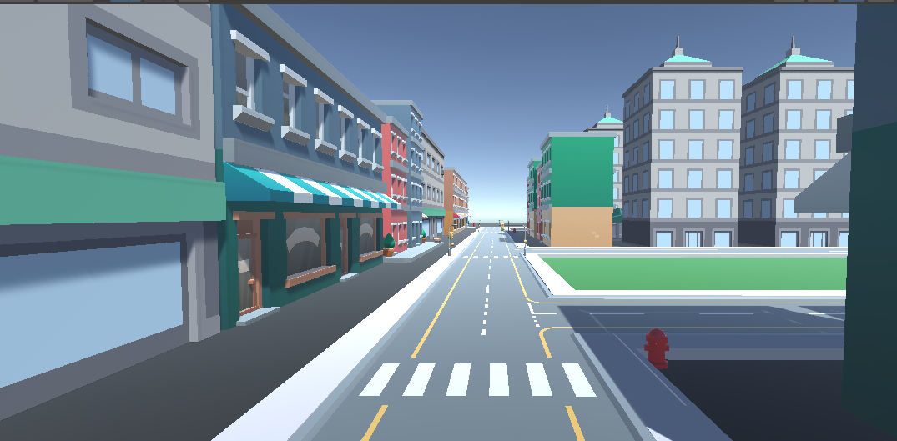   
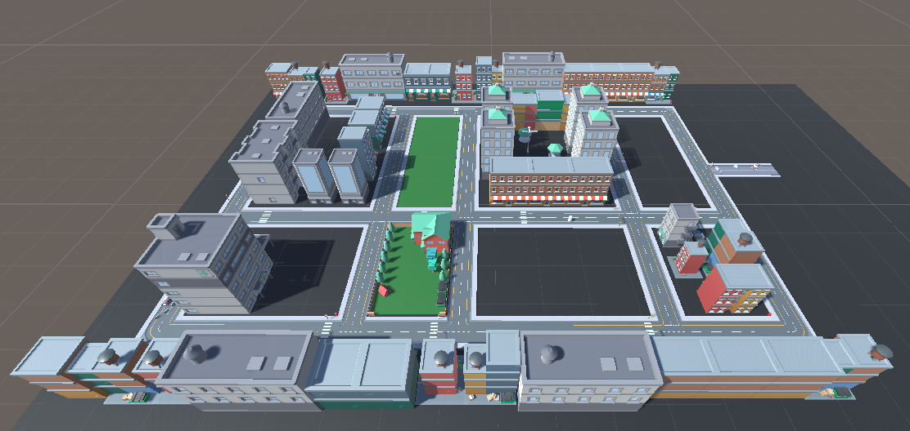   
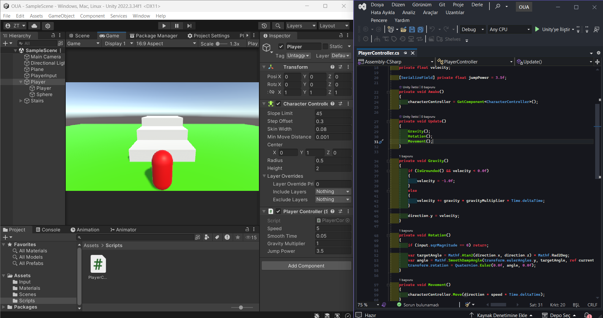   
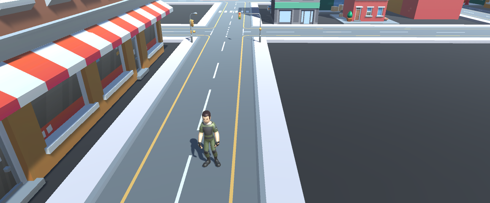   

### Sprint Review
- Takım üyeleri tanıştı ve görev dağılımı yapıldı.
- Oyunun nasıl ilerleyeceği hakkında kararlar alındı.
- Harita, alınan kararlar doğrultusunda tasarlandı.
- Hareket sistemi hazırlandı ve animasyonlar verildi.
- Daily Scrum'larda seçilen karakter oyuna entegre edildi.

### Sprint Retrospective
- Takım içi dağıtılan rollerin 2. sprintte de geçerli olmasına karar verildi.
- II. Sprint'te projeye daha fazla odaklanılması gerektiği vurgulandı.
- II. Sprint'e dair bazı görevler verildi.

<!-- ============================================================================================= SPRINT2 ============================================================================================================= -->

<h2>SPRINT-2</h2>

- Sprint içi puan kriteri 15 olarak belirlenmiş ve hedefe ulaşılmıştır.
- **Puan Tamamlama Mantığı** : Proje boyunca tamamlanması gereken backlog puanı 40 olarak belirlenmiştir.
- **Daily Scrum** toplantıları Discord üzerinden yapılmıştır. Gerek görüldüğü vakitlerde WhatsApp üzerinden desteklenmiştir.
- **Sprint Notları** : İkinci sprintte oyuna full odak verilmiştir ve oyunun temeli üzerine her şey hazırlanmıştır. Üçüncü ve son sprinte zamansal olarak herhangi bir sıkıntı olmadan giriş yapılması beklenmekte.

<h3>Daily Scrum Screenshots</h3>

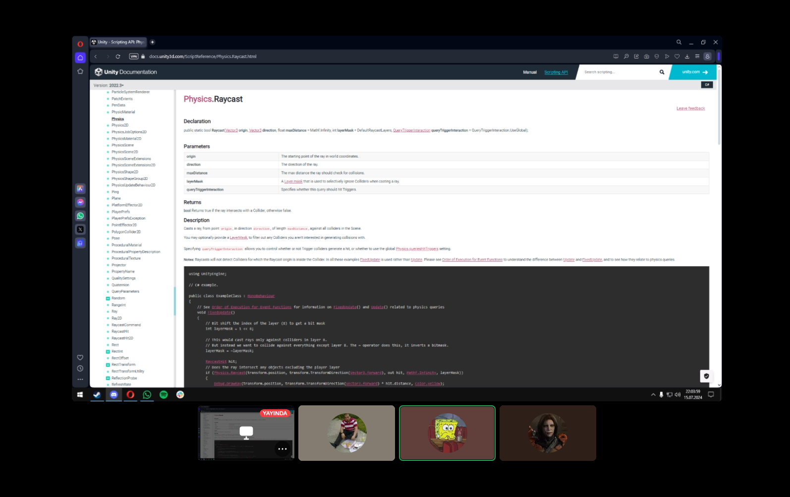   
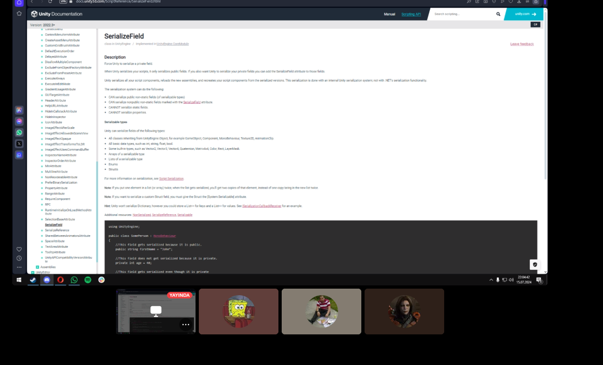   

  
  

<h3>Sprint - 2 Board Update</h3>

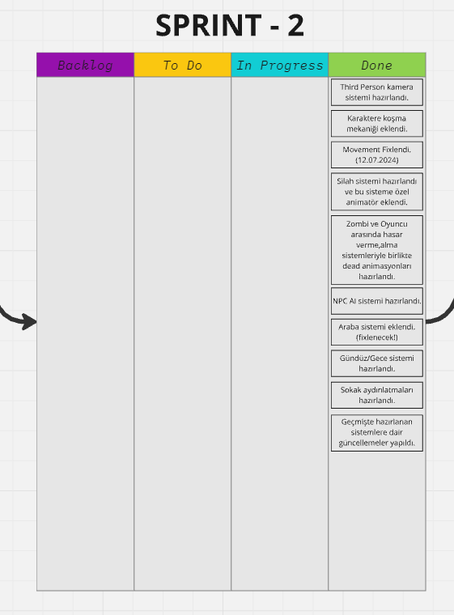    

<h3>Oyun Durumu</h3>

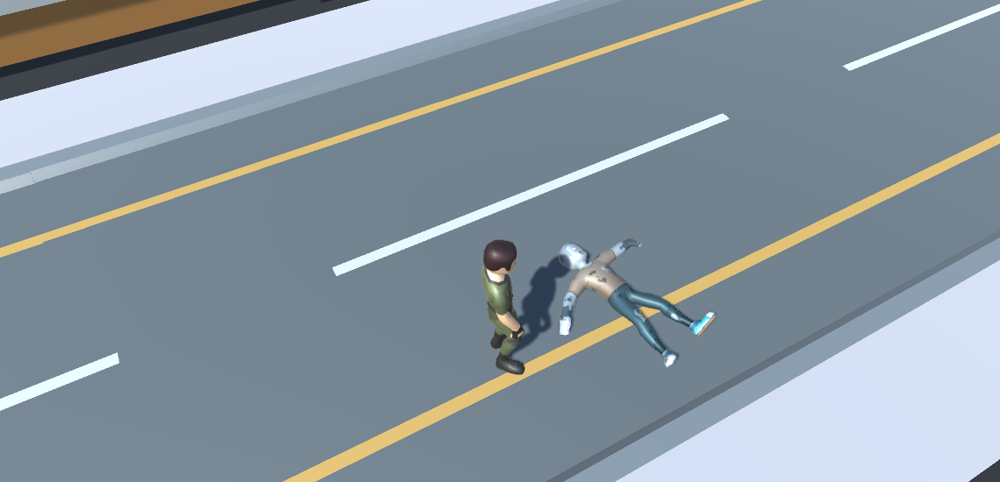   
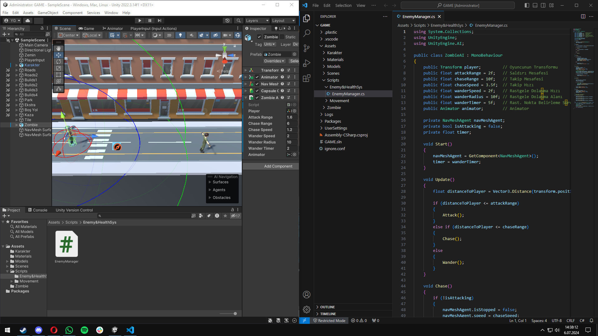   
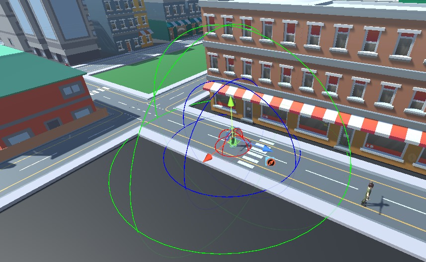   

### Sprint Review
- İlk sprintte yapılması istenen fakat tanışma&toplantılar sebebiyle yapılamayan sistemler yapıldı.
- Oyunun temel mekanikleri hazırlandı ve problemleri fixlendi.
- Son sprinte daha rahat girebilmek için çoğu sistem hazırlandı ve bug testleri yapıldı.

### Sprint Retrospective
- Takım içi dağıtılan rollerin son sprintte de geçerli olmasına karar verildi.
- Son sprinti sorunsuz tamamlamak için tekrardan full odak uyarısı yapıldı.
- III. sprinte dair tüm görevler verildi.

<!-- ============================================================================================= SPRINT3 ============================================================================================================= -->

<h2>SPRINT-3</h2>

- Sprint içi puan kriteri 15 olarak belirlenmiş ve hedefe ulaşılmıştır.
- **Puan Tamamlama Mantığı** : Proje boyunca tamamlanması gereken backlog puanı 40 olarak belirlenmiştir ve proje sonu 40 puana ulaşılmıştır.
- **Daily Scrum** toplantıları Discord üzerinden yapılmıştır. Gerek görüldüğü vakitlerde WhatsApp üzerinden desteklenmiştir.
- **Sprint Notları** : Üçüncü sprintte oyunun son sistemleri eklenmiştir ve tanıtımına dair görseller ve videolar hazırlanmıştır.

<h3>Daily Scrum Screenshots</h3>

   
   

  
  

<h3>Sprint - 3 Board Update</h3>

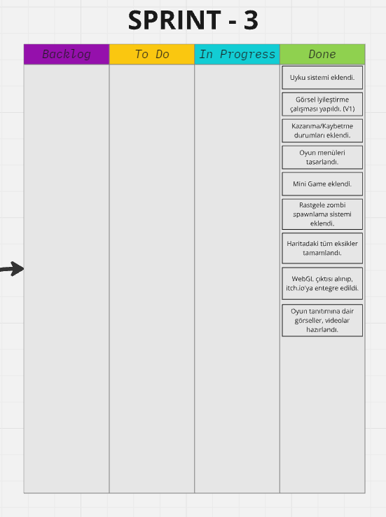    

<h3>Oyun Durumu</h3>

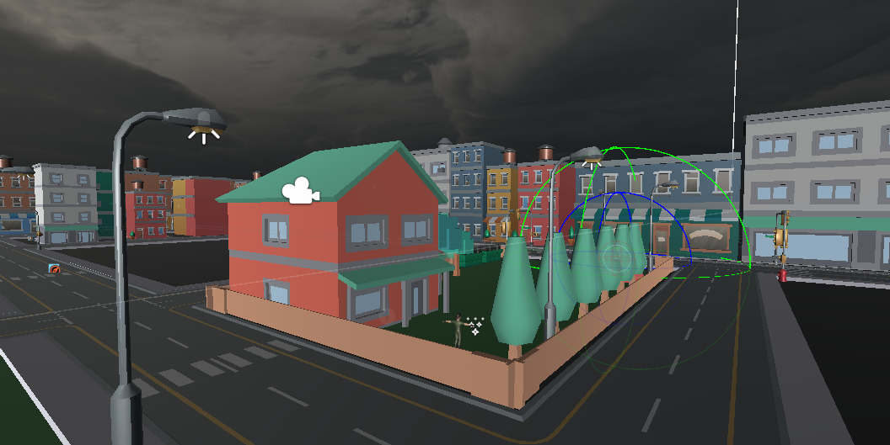   
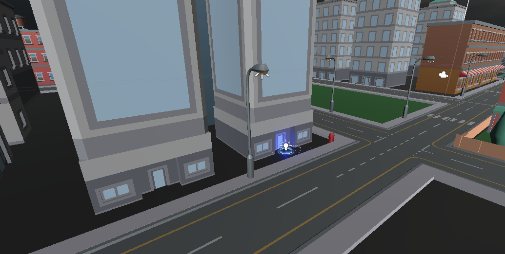   
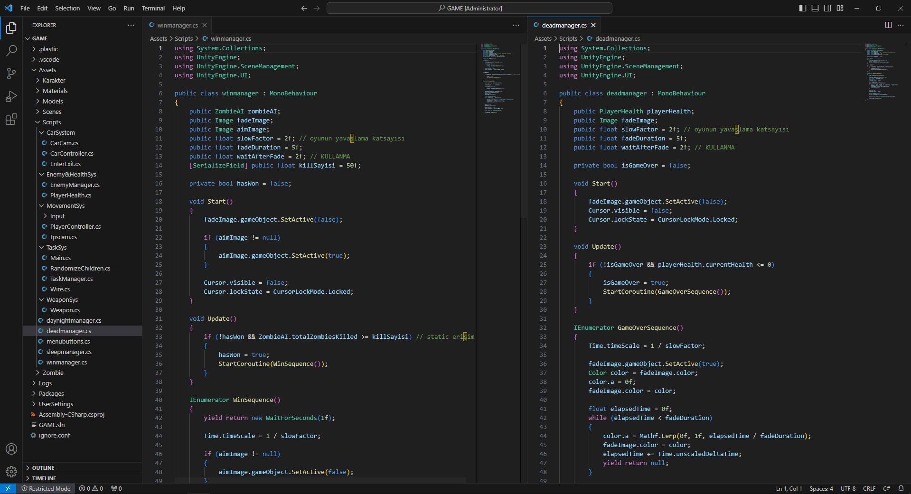   

### Sprint Review
- İkinci sprintte hazırlanan sistemlerin bug'ları tespit edilip fixlendi.
- Son eklenmesi gereken sistemler eklendi ve bug'ları tespit edilip fixlendi.
- Oyun tanıtımına dair fotoğraf ve videolar hazırlandı.
- WebGL çıktısı alınıp itch.io sayfasına entegre edildi.
- Takım içi son değerlendirme toplantısı yapıldı.

### Sprint Retrospective
- Proje sonuna gelindi. Takım üyeleri arasında ileri tarihlerde yapılabilecek yeni projeler için iletişimde kalınacağına dair konuşmalar yapıldı.
  

<!-- ============================================================================================= PROJE ============================================================================================================= -->

